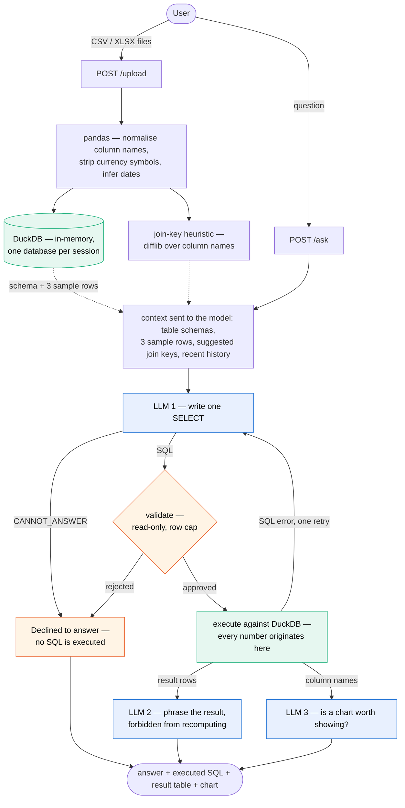

# truthtable

A full-stack AI data Q&A app: upload one or more CSV/Excel files, and ask
questions about them in plain English. The app turns each question into a
DuckDB SQL query, runs it against your actual uploaded data, and returns a
natural-language answer alongside the exact SQL used (so you can verify it
rather than just trust it) and, where it helps, a chart.

> **[WRITEUP.md](WRITEUP.md)** — one-page summary of the approach, the key
> decisions and their trade-offs, and what I'd build next.

## Architecture



Blue nodes are the only places a language model is involved; green is where
computation actually happens; orange are the guardrails. The shape of the
diagram is the point: **the model writes SQL and phrases results, but never
touches a number.** Validation enforces `SELECT`/`WITH` only, a keyword
blocklist (`INSERT/UPDATE/DELETE/DROP/ALTER/...`) and an automatic row cap
before anything reaches the database.

## How it works

1. **Upload** — CSV/XLSX/XLS files are parsed with pandas, cleaned (column
   names normalized to snake_case, currency/percent symbols stripped and
   numeric-coerced, date columns inferred), and materialized as tables in an
   in-memory DuckDB database scoped to your session.
2. **Ask** — your question, the schema of every uploaded table (columns +
   types + sample rows), a few heuristic join-key suggestions across tables,
   and recent conversation history are sent to an LLM, which returns a single
   `SELECT` query — or `CANNOT_ANSWER: <reason>` if the schema can't answer
   it or the join would be a guess.
3. **Execute** — the query is validated (SELECT/WITH only, no
   DDL/DML keywords, an automatic `LIMIT` if none given) and run directly
   against DuckDB — the numbers you see are computed by DuckDB, not
   hallucinated by the LLM. If it fails, the LLM gets one retry with the
   error message.
4. **Answer** — a second LLM call turns the *already-computed* result into
   one plain-English sentence (explicitly instructed not to recompute or
   invent numbers), and a third call decides whether a chart would help.

## What this adds on top of "just call an LLM"

An LLM alone will answer *every* question, confidently, whether or not the
data supports it. Each of the following exists because the naive version
failed a test I ran against it — and each one is visible in the UI, not
hidden in the backend.

**It refuses instead of guessing a join.** This is the one that mattered
most. Given `sales.csv` (`store_id, date, revenue`) and `weather.csv`
(`city, date, temperature`) — two files whose *only* shared column is
`date` — the model happily wrote `JOIN weather USING (date)`. The query ran
without error and returned confident per-store revenue totals that were
**silently wrong**: every store row matched every city's weather row for
that date, duplicating revenue in the sum. Nothing about the output looked
broken. The fix was to make the prompt require a join column to be a real
shared *identifier*, not an incidental shared attribute, and to answer
`CANNOT_ANSWER` otherwise. It now replies: *"no reliable join between
weather and sales (date not a unique identifier for linking stores to
cities)."* The UI renders that as a distinct amber **"Declined to answer"**
card, so a refusal reads as a deliberate safety behaviour rather than a
failure.

**The LLM never does arithmetic.** It only writes SQL; DuckDB computes every
number. The summarising call receives the already-computed rows and is
explicitly forbidden from recomputing or introducing outside figures — so
the sentence can only ever re-phrase numbers that a real query engine
produced.

**Join candidates are suggested, not guessed.** Before the model sees the
question, column names are compared pairwise across files (`difflib`
similarity, with extra weight when both end in `id`). That's how it links
`orders.cust_id` to `customers.customer_id` despite the names not matching.
These candidates are shown in the UI under **"Detected relationships"**, so
you can see what the model was told.

**Generated SQL is validated before it runs.** `SELECT`/`WITH` only, a
word-boundary blocklist (`INSERT/UPDATE/DELETE/DROP/ALTER/CREATE/ATTACH/
COPY/PRAGMA/EXPORT/IMPORT/CALL`), and an automatic row cap. The UI shows the
**post-validation** query — what actually executed, row cap included — not
the model's raw proposal.

**It self-corrects once.** If DuckDB rejects the query, the error text goes
back to the model for exactly one retry (never a loop). When that happens
the answer is tagged **"Self-corrected after a SQL error"**.

**Accuracy is measured, not assumed.** `backend/tests/eval_questions.py`
runs a fixed question set and grades the **computed numeric result** against
values calculated independently with pandas — so a fluent-but-wrong answer
fails. It's the regression test for prompt changes; the join-guard fix above
was verified not to break the legitimate-join cases this way.

## Tech stack, and why

**Backend: FastAPI + DuckDB (Python 3.11)**
- FastAPI for a small, typed, async-friendly API surface with minimal
  boilerplate.
- DuckDB as the query engine because it runs in-process (no separate DB
  server to stand up for a prototype), reads CSV/pandas DataFrames natively,
  and speaks real SQL — so the LLM's job is just "write SQL," not learn a
  bespoke query DSL, and the actual computation (sums, joins, filters) is
  done by a real execution engine instead of the LLM doing arithmetic.
- pandas + openpyxl for ingestion, since they're the most robust way to
  handle inconsistent real-world CSV/Excel formatting (currency symbols,
  mixed date formats, multi-sheet workbooks).

**LLM layer: Groq running Llama (`openai/gpt-oss-120b`)**
- Groq's inference is fast enough that a chat-style "ask a question, get an
  answer" UX doesn't feel like it's stuck behind a slow API call.
- Using an open-weight model via Groq keeps the app provider-agnostic and
  cheap to run for a prototype; the model is swappable via `GROQ_MODEL`.
- `temperature=0` everywhere — this is a data tool, not a creative one;
  determinism matters more than variety.

**Frontend: Next.js (App Router, TypeScript, Tailwind)**
- App Router + a single client-side page is enough for this app's shape (one
  session, one conversation) without needing server-side data fetching or
  multiple routes.
- Tailwind for fast, consistent styling without a component library
  dependency.
- Recharts for charts — small API surface, good enough defaults for
  bar/line/pie without needing a heavier visualization library.

## Project layout

```
backend/
  app/
    main.py          FastAPI app: /session, /upload, /ask
    session.py        In-memory session store (DuckDB connection per session)
    ingestion.py       File parsing, cleaning, schema description, join hints
    llm.py             Groq calls: generate_sql, suggest_chart, summarize_answer
    query_engine.py     SQL validation + execution against DuckDB
  tests/
    test_ingestion.py
    test_query_engine.py
    eval_questions.py   Standalone LLM-accuracy eval (see below)
frontend/
  app/page.tsx          Upload zone + chat interface
  components/ResultChart.tsx
  lib/api.ts             Typed client for the backend API
  lib/format.ts           Display formatting for result values
sample_data/              Example CSVs used in manual testing and the eval script
```

### Sample data

`sample_data/` holds two deliberately-imperfect files, sized so that trend
questions have something real to show:

- `orders.csv` — 200 orders across Jan–Jun 2024 (`order_id, cust_id,
  category, amount, order_date`), with amounts formatted as `"$1,234.56"` so
  ingestion has to strip currency symbols and thousands separators.
- `customers.csv` — 16 customers across 4 regions (`customer_id, name,
  region`).
- `regional_plan.xlsx` — a two-sheet workbook (`Targets`, `Headcount`) that
  becomes two separate tables, `regional_plan_targets` and
  `regional_plan_headcount`, to exercise multi-sheet Excel ingestion.

The key detail is `orders.cust_id` vs `customers.customer_id`: the join
column is named differently in each file, so cross-file questions only work
if the relationship is actually inferred rather than assumed. Monthly
revenue trends upward over the six months, so "revenue over time" produces a
meaningful line chart.

A question that exercises all of it at once — three tables, two files, two
formats, and a two-hop join:

> *Which regions beat their H1 target revenue, and by how much?*

(orders → customers on `cust_id`/`customer_id` → the Excel `Targets` sheet
on `region`.)

## Setup

### Prerequisites

- A free Groq API key from https://console.groq.com
- Either Docker, or Python 3.11 + Node.js locally

### 1. Environment variables

```bash
cp .env.example .env
# edit .env and set GROQ_API_KEY=<your key>
```

`.env` (repo root) is used by the backend, whether run via Docker or
directly. `GROQ_MODEL` defaults to `openai/gpt-oss-120b` if unset.

### 2. Backend

**With Docker (recommended):**

```bash
docker compose up --build
```

API is available at http://localhost:8000, with live reload on changes to
`backend/app`.

**Without Docker:**

```bash
cd backend
python3.11 -m venv venv
source venv/bin/activate
pip install -r requirements.txt
export $(grep -v '^#' ../.env | xargs)   # load GROQ_API_KEY into the shell
uvicorn app.main:app --reload
```

### 3. Frontend

```bash
cd frontend
cp .env.local.example .env.local   # NEXT_PUBLIC_API_URL=http://localhost:8000
npm install
npm run dev
```

Open http://localhost:3000, upload a CSV/Excel file (try the ones in
`sample_data/`), and start asking questions.

## Running the tests

Both commands below use the `truthtable-backend` image. `docker compose up
--build` (above) builds it; if you haven't run that, build it directly with
`docker build -t truthtable-backend ./backend`.

```bash
# unit tests (ingestion + query validation), no LLM calls, no API key needed
docker run --rm -v "$(pwd):/workspace" -w /workspace/backend \
  truthtable-backend python -m pytest tests -v

# or locally, from backend/ with the venv active:
pytest tests -v
```

## Running the accuracy eval

`backend/tests/eval_questions.py` is a standalone script (not a pytest
suite) that exercises the ingestion → LLM → query-engine pipeline directly
against `sample_data/` — no HTTP layer involved. It runs 8 fixed
question/expected-answer pairs (a simple total, an average, a filter, a
count, a cross-file join, a month-level trend, a period-over-period
comparison, and one deliberately unanswerable question) and grades each by
comparing the **computed numeric result** against the expected value — not
the LLM's wording, so a fluent-but-wrong answer still fails. The expected
values were computed independently with pandas over `sample_data/`, not
taken from a model response. It makes real LLM calls, so it needs
`GROQ_API_KEY` set.

```bash
docker run --rm --env-file .env \
  -v "$(pwd):/workspace" -w /workspace \
  truthtable-backend python backend/tests/eval_questions.py

# or locally, from the repo root with the venv active and GROQ_API_KEY exported:
python backend/tests/eval_questions.py
```

It prints PASS/FAIL per question plus a summary line, and exits non-zero if
anything failed — useful for re-running after prompt changes to catch
regressions in answer accuracy.
